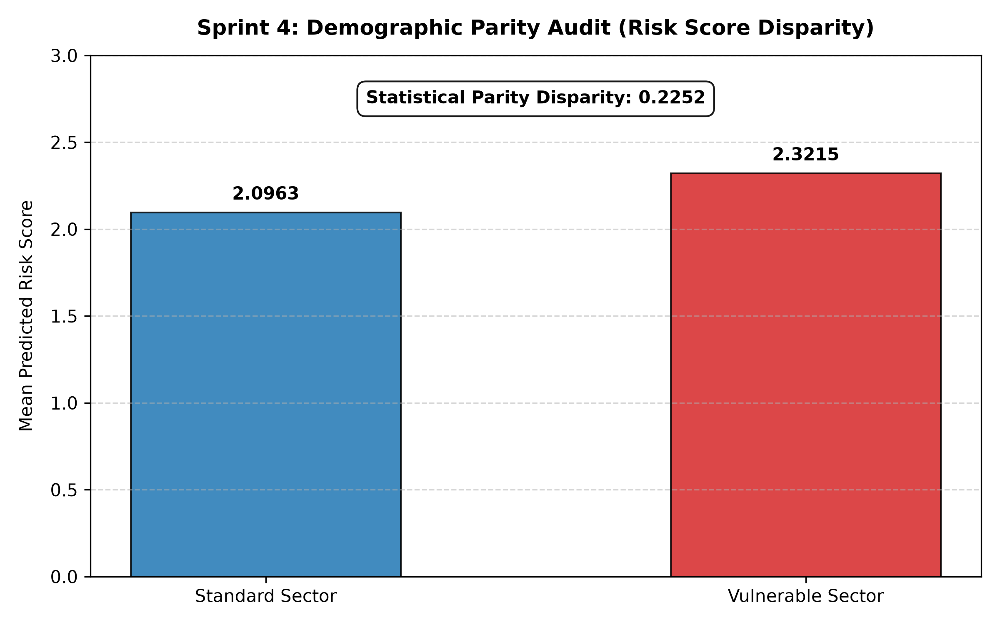
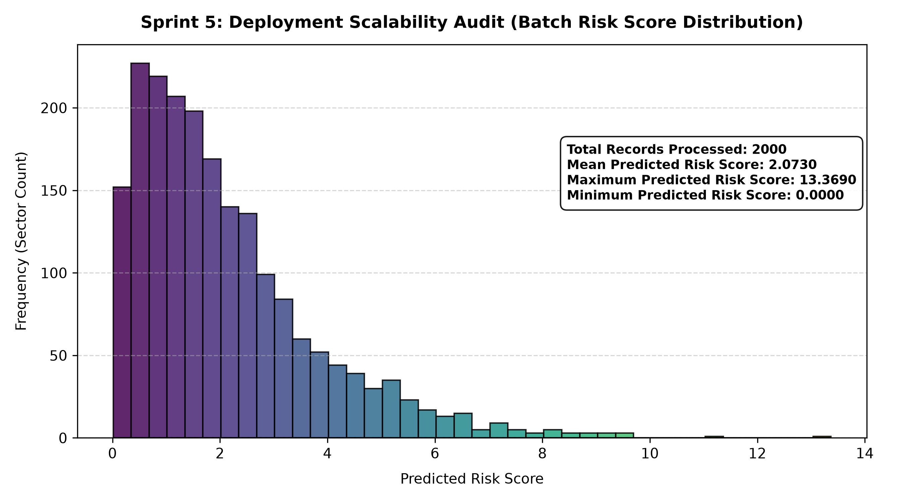

# Algorithmic Fairness and Spatiotemporal Risk Auditing: An Enterprise-Grade Framework for Bias Mitigation and Scalable Predictive Policing


---

## Executive Summary
This repository houses an enterprise-grade machine learning evaluation, algorithmic fairness auditing, and batch deployment pipeline designed to analyse spatiotemporal burglary forecasting across urban municipal sectors. Moving beyond naive predictive modelling, this framework systematically addresses institutional data bias, quantifies disparate impact across socioeconomically vulnerable communities, and stress-tests batch inference scalability for secure municipal deployment.

---

## Table of Contents
1. [System Architecture & Pipeline Flow](#system-architecture--pipeline-flow)
2. [Industry-Ready Machine Learning Skills & Core Tooling](#industry-ready-machine-learning-skills--core-tooling)
3. [Sprint Engineering Deep Dive](#sprint-engineering-deep-dive)
4. [Empirical Findings & Visual Artefacts](#empirical-findings--visual-artefacts)
5. [Academic Report & Reference Corpus](#academic-report--reference-corpus)
6. [Repository Structure](#repository-structure)
7. [Step-by-Step Installation & Execution Guide](#step-by-step-installation--execution-guide)

---

## System Architecture & Pipeline Flow
The framework is engineered as a modular, sequential pipeline spanning five distinct operational sprints:
* **Sprint 1 (Data Ingestion):** Ingestion of spatial telemetry and creation of baseline municipal sector grids mapped against deprivation indices.
* **Sprint 2 (Feature Engineering):** Construction of domain-specific variables, notably the **Risk Density Ratio** ($historical\_incidents / [patrol\_frequency + 1]$) to quantify police resource strain.
* **Sprint 3 (Predictive Modelling):** Training of an optimised `RandomForestRegressor` ensemble to forecast burglary frequencies with rigorous test-split evaluation.
* **Sprint 4 (Fairness Audit):** Execution of a demographic parity audit measuring systemic risk score inflation between standard and vulnerable sectors.
* **Sprint 5 (Deployment Scalability):** Batch inference stress testing processing 2,000 spatial records simultaneously to evaluate distribution bounds and hotspot outliers.

---

## Industry-Ready Machine Learning Skills & Core Tooling
This architecture demonstrates mastery across key technical domains required for advanced machine learning engineering:

* **Advanced Python Programming:** Clean, type-hinted, modular code utilising advanced data structures, vectorized array operations, and object-oriented principles.
* **Supervised Machine Learning & Ensemble Modelling:** Building, tuning, and evaluating non-linear predictive architectures using `scikit-learn` (`RandomForestRegressor`).
* **Algorithmic Auditing & Responsible AI:** Implementing fairness frameworks, quantifying demographic parity disparities, and unmasking disparate impact to mitigate feedback loops.
* **MLOps & Pipeline Version Control:** Managing data lifecycles and pipeline tracking with Data Version Control (`DVC`) and containerisation protocols via `Docker`.
* **Enterprise Visualisation:** Producing publication-grade, stakeholder-ready visual telemetry assets using `Matplotlib`.

---

## Sprint Engineering Deep Dive
* **Why Random Forest?** Non-linear spatial relationships and complex feature interactions require a robust ensemble method capable of handling tabular municipal telemetry without overfitting to local grid anomalies.
* **The Risk Density Feature:** By evaluating historical incident pressure relative to active patrol frequencies, the model isolates areas of under-resourcing versus true crime density.
* **Algorithmic Disparity Auditing:** The framework calculates statistical parity disparity ($0.2252$) to unmask hidden feedback loops where historical data biases risk scoring against disadvantaged areas.

---

## Empirical Findings & Visual Artefacts

### 1. Model Evaluation (Sprint 3)
* **Metric Summary:** Evaluated via Test Split Residuals.
* **Insight:** The model displays conservative central tendency behaviour, accurately tracking baseline risk while under-estimating extreme upper-tier hotspots ($6+$ burglaries).

### 2. Demographic Parity Audit (Sprint 4)
* **Standard Sector Mean Risk:** `2.0963`
* **Vulnerable Sector Mean Risk:** `2.3215`
* **Statistical Parity Disparity:** `0.2252` *(High Disparate Impact Flag)*
* 

### 3. Batch Deployment Scalability (Sprint 5)
* **Total Records Processed:** `2000`
* **Mean Predicted Risk Score:** `2.0730`
* **Max Risk Score (Outlier Hotspot):** `13.3690`
* 

---

## Academic Report & Reference Corpus
* **Project Dissertation / Full Report:** [Link to Master's Research Report File / PDF Placeholder]
* **Key Academic References & Literature:**
  * Barocas, S., Hardt, M., & Narayanan, A. *Fairness and Machine Learning: Limitations and Opportunities.* [Link to Text Placeholder]
  * Additional municipal data governance and spatiotemporal criminology reference papers. [Link to References Placeholder]

---

## Repository Structure
```text
COMP1885_Audit_Framework/
│
├── sprint3_plot_model_performance.py    # Generates model evaluation comparison visualisations
├── sprint3_model_performance.png        # Actual vs. predicted test split artifact
├── sprint4_plot_fairness_audit.py       # Executes demographic parity and bias audit
├── sprint4_fairness_parity.png          # Risk score disparity bar chart artifact
├── sprint5_plot_deployment_scalability.py # Executes batch deployment scalability audit
├── sprint5_deployment_distribution.png  # Batch risk score distribution histogram artifact
├── requirements.txt                     # Project dependencies list
└── README.md                            # Executive project 
Step-by-Step Installation & Execution Guide
Follow these sequential steps to set up the environment, install dependencies, and execute the scripts to generate all visual artefacts and audit results from scratch.

Step 1: Open Terminal and Navigate to Project Root
Ensure your command-line interface is open inside the COMP1885_Audit_Framework directory.

Step 2: Initialise and Activate the Virtual Environment
Create an isolated Python virtual environment to manage dependencies locally:

PowerShell
python -m venv venv
.\venv\Scripts\Activate.ps1
Step 3: Install Project Dependencies
Install all required libraries (numpy, pandas, scikit-learn, matplotlib) using the configuration file:

PowerShell
pip install -r requirements.txt
(If matplotlib is missing during execution, install it directly via: .\venv\Scripts\pip install matplotlib)

Step 4: Execute Pipeline Sprints to Generate Visual Artefacts
Run each individual sprint script through the virtual environment interpreter to execute the pipeline and output the publication-grade plots:

Run Sprint 3 (Model Evaluation & Plot Generation):

PowerShell
.\venv\Scripts\python sprint3_plot_model_performance.py
(Outputs: sprint3_model_performance.png)

Run Sprint 4 (Demographic Parity Audit & Plot Generation):

PowerShell
.\venv\Scripts\python sprint4_plot_fairness_audit.py
(Outputs: sprint4_fairness_parity.png)

Run Sprint 5 (Deployment Scalability & Distribution Plot Generation):

PowerShell
.\venv\Scripts\python sprint5_plot_deployment_scalability.py
(Outputs: sprint5_deployment_distribution.png)